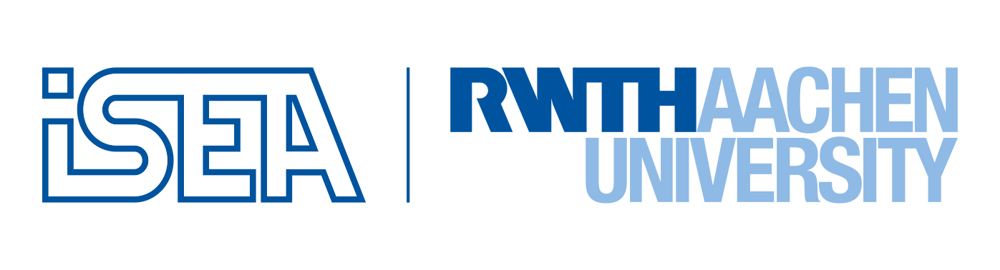

<pre>
 
  

</pre>

About ISEAFrame
==============================
The <a href=http://www.isea.rwth-aachen.de/>ISEA</a> Battery Framework is a real time capable simulation framework  written in C++. It allows coupled electrical-thermal simulations of single storage systems (e.g. lithium ion batteries or double layer capacitors) or complete storage system packs. These packs may consist of arbitrary but reasonable series and parallel connections of single storage systems. The electrical simulations are based on impedance based modeling, the thermal simulations on the finite volume method (FVM).
The simulation framework can be used for the following purposes:
+ Development and testing of battery management systems (BMS). Particularly it is possible to investigate the BMS behavior in an error case of the storage system (e.g. short circuits or thermal issues).
+ Dimensioning, development and testing of storage system packs. I.e. it is possible to evaluate and optimize pack geometry, electrical and thermal topologies as well as optimized cooling properties for a storage system pack for given requirements.
+ Since the simulation framework is real time capable it can be implemented on a Hardware in the loop platform (HIL) to estimate crucial states of storage system packs used in electric vehicles (e.g. state of charge, state of health, state of function). A quick and accurate parameterization of the implemented model can be achieved by electrochemical impedance spectroscopy (EIS) and time domain measurements (TDM).

For electrical parameter identification the [FittingGUI](https://github.com/HWitz/FittingGUI ) is suggested.
The author of the FittingGUI worked very close with the development team for implementation of electrical equivalent circuits.

Introduction video
===================

Downloads
=========
Precompiled versions can be downloaded from Gitlab.

Linux Standalones: [Download](https://git.rwth-aachen.de/isea/framework/-/jobs/artifacts/master/download?job=linux_standalones) 
Windows Standalones: [Download](https://git.rwth-aachen.de/isea/framework/-/jobs/artifacts/master/download?job=windows_standalones) 
Wndows Simulink Converter: [Download](https://git.rwth-aachen.de/isea/framework/-/jobs/artifacts/master/download?job=windows_simulink_converter) 
  
Documentation: [View online](https://isea.pages.rwth-aachen.de/framework) | [Download](https://git.rwth-aachen.de/isea/framework/-/jobs/artifacts/master/download?job=documentation) | [Download Development Version](https://git.rwth-aachen.de/isea/framework/-/jobs/artifacts/master/download?job=documentation)

Required Software:
==============================
+ eigen3
+ armadillo
+ boost
+ matio

Compiling
=========
This software can be compiled on Linux or Windows. Instructions can be found in the [documentation](https://isea.pages.rwth-aachen.de/framework/compiling.html).

Documentation
=========
A developer version and a user version of the documentation is available.
The user documentation can be build with doxygen by using "Doxyfile_release.in".
The other one can be build as described by running 
<pre>
make doc 
</pre>

The current version of the documentation can be viewed [here](https://isea.pages.rwth-aachen.de/framework)

Featured Projects
=================
Parts of the framework are used in the following projects:
1. Toolbox Speichersysteme, Energy Storage Toolbox 
  * Förderkennzeichen: 64.65.69-EM-2011A

2. Offenes Batterie-Alterungs-Tool zur Lebensdauerprognose von Batteriepacks unter Berücksichtigung von Unsicherheiten und Streuung von Zellqualität,
  * Förderkennzeichen: 0325905

Authors
===========
Please acknowledge the [authors](DevelopmentTeam.md).

License
=========
The ISEA-Framework is published under the BSD 3-Clause License.
Further information can be requested at batteries@isea.rwth-aachen.de .

